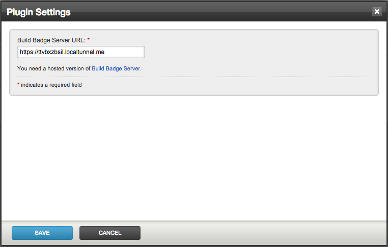

# gocd-build-badge-notifier
Plugin notifies all pipeline build status to an instance of [Build Badge notifier](https://github.com/ashwanthkumar/gocd-build-badge-server).

## Setup
- Download jar from releases & place it in /plugins/external & restart Go Server.
- Make sure you have an instance of [build badge server](https://github.com/ashwanthkumar/gocd-build-badge-server) running. The README has 1-click deploy to Heroku.

## Configuration
You need to set a URL to an instance of [build badge server](https://github.com/ashwanthkumar/gocd-build-badge-server).



## Markdown Syntax
To add the badge to the README of your private repo projects you could use the following template. Make sure you update the `HOST_OF_BADGE_SERVER` and `Pipeline-Name`.

```markdown
[](http://ci-server:8153/go/tab/pipeline/history/Pipeline-Name)
```

## How does it work?
Since there isn't any way to determine if the pipeline has completed or store the status of the last run stage in the pipeline on the badge server and return a badge based on that.

## License

http://www.apache.org/licenses/LICENSE-2.0
